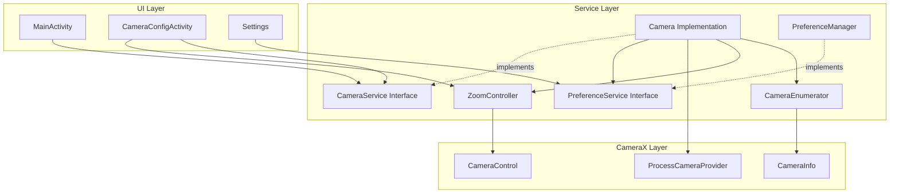
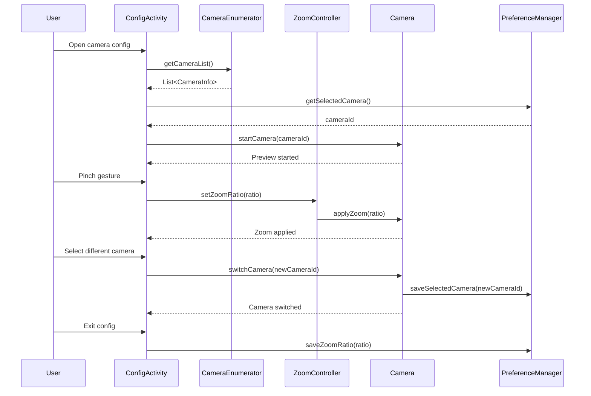

# Design Document: Camera Selection and Zoom Configuration

## Overview

This feature extends the DashCamApp to support multi-camera selection and zoom configuration, enabling users to leverage all available camera hardware on their devices. The design introduces a camera configuration screen where users can preview and select from available cameras (wide, ultra-wide, telephoto) and adjust zoom levels either through pinch gestures or manual controls. The implementation builds upon the existing CameraX architecture and preference management system.

The feature consists of three main components:
1. **Camera enumeration and selection** - Discovering and switching between physical cameras
2. **Zoom control system** - Managing zoom ratios with gesture and UI controls
3. **Configuration UI** - A dedicated screen for camera and zoom setup

## Architecture

### High-Level Architecture



### Component Interaction Flow



## Components and Interfaces

### 1. CameraEnumerator

**Purpose**: Discovers and provides information about all available physical cameras on the device.

**Responsibilities**:
- Enumerate all available cameras using CameraX CameraProvider
- Extract camera characteristics (lens facing, field of view type)
- Provide zoom capability information for each camera
- Map CameraX camera IDs to user-friendly names

**Interface**:
```kotlin
data class CameraInfo(
    val id: String,
    val displayName: String,
    val lensFacing: Int, // CameraSelector.LENS_FACING_BACK or LENS_FACING_FRONT
    val fieldOfView: FieldOfViewType,
    val minZoomRatio: Float,
    val maxZoomRatio: Float,
    val supportsZoom: Boolean
)

enum class FieldOfViewType {
    ULTRA_WIDE,  // < 90 degrees
    WIDE,        // 90-120 degrees
    STANDARD,    // 120-180 degrees
    TELEPHOTO    // > 180 degrees
}

interface CameraEnumeratorService {
    suspend fun getCameraList(context: Context): List<CameraInfo>
    suspend fun getCameraInfo(context: Context, cameraId: String): CameraInfo?
    fun getDefaultCameraId(): String
}
```

### 2. ZoomController

**Purpose**: Manages zoom operations including gesture-based and programmatic zoom control.

**Responsibilities**:
- Handle pinch gesture detection and translation to zoom ratios
- Apply zoom ratios to the active camera
- Enforce min/max zoom boundaries
- Provide smooth zoom transitions
- Persist zoom settings per camera

**Interface**:
```kotlin
interface ZoomControllerService {
    fun setCamera(cameraControl: androidx.camera.core.CameraControl, cameraInfo: androidx.camera.core.CameraInfo)
    fun setZoomRatio(ratio: Float): Boolean
    fun getZoomRatio(): Float
    fun getMinZoomRatio(): Float
    fun getMaxZoomRatio(): Float
    fun handlePinchGesture(scaleFactor: Float)
    fun resetZoom()
}

class ZoomController : ZoomControllerService {
    private var cameraControl: CameraControl? = null
    private var cameraInfo: CameraInfo? = null
    private var currentZoomRatio: Float = 1.0f
    
    // Implementation details...
}
```

### 3. CameraConfigActivity

**Purpose**: Provides a dedicated UI for camera selection and zoom configuration.

**Responsibilities**:
- Display live camera preview
- Show list of available cameras with characteristics
- Handle camera selection changes
- Manage pinch-to-zoom gestures on preview
- Display current zoom level indicator
- Save configuration on exit

**Key UI Elements**:
- PreviewView for live camera feed
- RecyclerView for camera list
- Zoom indicator overlay (TextView with fade animation)
- Save/Cancel buttons

### 4. Extended PreferenceService

**Purpose**: Persist camera and zoom preferences.

**New Methods**:
```kotlin
interface PreferenceService {
    // Existing methods...
    
    // Camera selection preferences
    fun getSelectedCameraId(context: Context): String
    fun setSelectedCameraId(context: Context, cameraId: String)
    
    // Zoom preferences (per camera)
    fun getZoomRatio(context: Context, cameraId: String): Float
    fun setZoomRatio(context: Context, cameraId: String, ratio: Float)
    
    // Default zoom for new cameras
    fun getDefaultZoomRatio(context: Context): Float
    fun setDefaultZoomRatio(context: Context, ratio: Float)
}
```

### 5. Extended CameraService

**Purpose**: Add camera selection and zoom capabilities to existing camera service.

**New Methods**:
```kotlin
interface CameraService {
    // Existing methods...
    
    // Camera selection
    fun switchCamera(cameraId: String)
    fun getCurrentCameraId(): String
    fun getCameraInfo(): CameraInfo?
    
    // Zoom control
    fun setZoomRatio(ratio: Float): Boolean
    fun getZoomRatio(): Float
    fun getZoomRange(): Pair<Float, Float>
}
```

## Data Models

### CameraInfo
```kotlin
data class CameraInfo(
    val id: String,                    // Unique camera identifier
    val displayName: String,           // User-friendly name (e.g., "Back Wide", "Front")
    val lensFacing: Int,               // LENS_FACING_BACK or LENS_FACING_FRONT
    val fieldOfView: FieldOfViewType,  // Camera FOV classification
    val minZoomRatio: Float,           // Minimum zoom (typically 1.0)
    val maxZoomRatio: Float,           // Maximum zoom (device-dependent)
    val supportsZoom: Boolean          // Whether zoom is available
)
```

### CameraPreference
```kotlin
data class CameraPreference(
    val cameraId: String,
    val zoomRatio: Float,
    val lastUsedTimestamp: Long
)
```

## Correctness Properties

*A property is a characteristic or behavior that should hold true across all valid executions of a system-essentially, a formal statement about what the system should do. Properties serve as the bridge between human-readable specifications and machine-verifiable correctness guarantees.*

### Property 1: Camera enumeration completeness
*For any* device with N physical cameras, the CameraEnumerator SHALL return exactly N CameraInfo objects with unique IDs
**Validates: Requirements 1.1**

### Property 2: Camera selection persistence
*For any* selected camera ID, after saving and restarting the application, the PreferenceService SHALL return the same camera ID
**Validates: Requirements 1.4**

### Property 3: Zoom ratio bounds enforcement
*For any* zoom ratio value outside the range [minZoom, maxZoom], the ZoomController SHALL clamp the value to the nearest boundary
**Validates: Requirements 2.3, 2.4**

### Property 4: Zoom ratio persistence per camera
*For any* camera ID and zoom ratio pair, after switching to a different camera and back, the system SHALL restore the original zoom ratio for the first camera
**Validates: Requirements 5.4**

### Property 5: Preview update responsiveness
*For any* zoom ratio change, the preview SHALL reflect the new zoom level within 100 milliseconds
**Validates: Requirements 2.5, 4.2**

### Property 6: Fallback to default camera
*For any* stored camera ID that is no longer available, the system SHALL fall back to the default back camera and update stored preferences
**Validates: Requirements 1.5, 5.5**

### Property 7: Zoom indicator visibility timing
*For any* zoom adjustment, if no further adjustments occur for 3 seconds, the zoom indicator SHALL fade out
**Validates: Requirements 4.4, 4.5**

### Property 8: Camera characteristics accuracy
*For any* camera in the enumerated list, the displayed field of view type SHALL match the actual camera characteristics reported by CameraX
**Validates: Requirements 6.1, 6.2**

## Error Handling

### Camera Enumeration Errors
- **No cameras available**: Display error message, prevent app usage
- **Camera info retrieval fails**: Log error, exclude camera from list
- **Permission denied**: Show permission rationale, request permissions

### Camera Selection Errors
- **Selected camera unavailable**: Fall back to default camera, notify user
- **Camera switch timeout**: Retry once, then fall back to previous camera
- **Camera initialization failure**: Display error toast, maintain previous camera

### Zoom Control Errors
- **Invalid zoom ratio**: Clamp to valid range, log warning
- **Zoom operation fails**: Maintain current zoom, log error
- **Camera doesn't support zoom**: Disable zoom controls, show message

### Preference Storage Errors
- **Save failure**: Log error, continue with in-memory state
- **Load failure**: Use default values, log warning
- **Corrupted preferences**: Reset to defaults, notify user

### UI Errors
- **Preview surface unavailable**: Show placeholder, retry initialization
- **Gesture detection failure**: Fall back to manual zoom controls
- **Activity lifecycle issues**: Properly release camera resources

## Testing Strategy

### Unit Testing

The testing approach combines unit tests for specific scenarios and property-based tests for universal correctness properties.

**Unit Test Coverage**:
1. **CameraEnumerator**
   - Test with mock CameraProvider returning known camera list
   - Verify camera info extraction for different camera types
   - Test default camera selection logic

2. **ZoomController**
   - Test zoom ratio clamping with boundary values
   - Test pinch gesture translation to zoom ratios
   - Test zoom state management

3. **PreferenceManager Extensions**
   - Test camera ID storage and retrieval
   - Test zoom ratio storage per camera
   - Test default value handling

4. **CameraConfigActivity**
   - Test camera list display
   - Test camera selection handling
   - Test zoom indicator visibility logic

### Property-Based Testing

**Property-Based Testing Library**: We will use **Kotest Property Testing** for Kotlin, which provides excellent support for property-based testing on Android.

**Configuration**: Each property-based test will run a minimum of 100 iterations to ensure thorough coverage of the input space.

**Property Test Coverage**:

1. **Camera Enumeration Completeness** (Property 1)
   - Generate random sets of mock cameras
   - Verify all cameras are enumerated with unique IDs
   - **Feature: camera-zoom-configuration, Property 1: Camera enumeration completeness**

2. **Camera Selection Persistence** (Property 2)
   - Generate random camera IDs
   - Save, clear, and reload preferences
   - Verify retrieved ID matches saved ID
   - **Feature: camera-zoom-configuration, Property 2: Camera selection persistence**

3. **Zoom Bounds Enforcement** (Property 3)
   - Generate random zoom ratios (including out-of-bounds values)
   - Apply to ZoomController
   - Verify result is within [min, max] range
   - **Feature: camera-zoom-configuration, Property 3: Zoom ratio bounds enforcement**

4. **Zoom Persistence Per Camera** (Property 4)
   - Generate random camera IDs and zoom ratios
   - Set zoom for camera A, switch to camera B, switch back to A
   - Verify camera A's zoom is restored
   - **Feature: camera-zoom-configuration, Property 4: Zoom ratio persistence per camera**

5. **Fallback Behavior** (Property 6)
   - Generate random invalid camera IDs
   - Attempt to load camera
   - Verify system falls back to default and updates preferences
   - **Feature: camera-zoom-configuration, Property 6: Fallback to default camera**

6. **Camera Characteristics Accuracy** (Property 8)
   - Generate random camera configurations
   - Verify displayed FOV type matches calculated type from characteristics
   - **Feature: camera-zoom-configuration, Property 8: Camera characteristics accuracy**

### Integration Testing

1. **End-to-End Camera Configuration Flow**
   - Open config screen → select camera → adjust zoom → save → verify in main activity

2. **Preference Persistence Across App Restarts**
   - Configure camera and zoom → close app → reopen → verify settings restored

3. **Multi-Camera Switching**
   - Switch between multiple cameras → verify each maintains independent zoom

4. **Gesture Handling**
   - Perform pinch gestures → verify zoom changes smoothly

### UI Testing (Espresso)

1. Test camera list display and selection
2. Test zoom indicator appearance and fade-out
3. Test configuration screen navigation
4. Test preview surface rendering

### Manual Testing Scenarios

1. Test on devices with different camera configurations (2, 3, 4+ cameras)
2. Test with devices that have ultra-wide and telephoto lenses
3. Test zoom smoothness during recording
4. Test camera switching during active recording (should be prevented)
5. Test behavior when camera becomes unavailable (e.g., another app uses it)

## Implementation Notes

### CameraX Integration

- Use `CameraProvider.getAvailableCameraInfos()` to enumerate cameras
- Use `CameraInfo.getZoomState()` to get zoom capabilities
- Use `CameraControl.setZoomRatio()` for programmatic zoom
- Use `CameraInfo.getLensFacing()` and `CameraInfo.getIntrinsicZoomRatio()` for camera characteristics

### Gesture Handling

- Implement `ScaleGestureDetector.OnScaleGestureListener` for pinch detection
- Apply scale factor incrementally to current zoom ratio
- Use `CameraControl.setLinearZoom()` for smooth transitions

### UI Considerations

- Use ConstraintLayout for responsive camera config screen
- Implement RecyclerView with custom adapter for camera list
- Use Material Design components for consistent styling
- Implement fade animations for zoom indicator using ObjectAnimator

### Performance Considerations

- Cache camera list to avoid repeated enumeration
- Use coroutines for camera operations to avoid blocking UI
- Debounce zoom updates during rapid pinch gestures
- Release camera resources properly in onPause/onStop

### Backward Compatibility

- Gracefully handle devices with single camera (hide camera selection)
- Provide sensible defaults for devices without zoom support
- Maintain existing camera functionality for users who don't use config screen

## Future Enhancements

1. **Advanced Zoom Controls**: Slider for precise zoom control, zoom presets
2. **Camera Switching During Recording**: Support hot-swapping cameras while recording
3. **Focus Control**: Add tap-to-focus and manual focus controls
4. **Exposure Control**: Add exposure compensation controls
5. **Camera Profiles**: Save and load complete camera configuration profiles
6. **Grid Overlay**: Add composition grid overlay options
7. **Aspect Ratio Selection**: Allow users to choose recording aspect ratio
