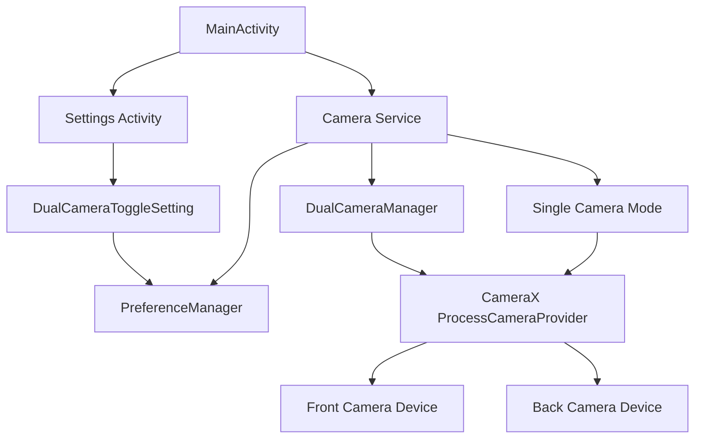

# Design Document: Dual Camera Recording

## Overview

This design implements concurrent dual camera recording for the DashCam application, allowing simultaneous video capture from both front and back cameras. The implementation leverages Android's CameraX Concurrent Camera API (available from API 30/Android 11) to bind multiple camera use cases to the lifecycle.

The feature integrates with the existing camera service architecture, settings system, and preference management. It includes device capability detection, dynamic UI layout switching, synchronized recording management, and graceful error handling with fallback to single-camera mode.

### Key Technical Constraints

- Requires Android API 30+ (Android 11) for concurrent camera support
- Not all devices with API 30+ support concurrent cameras (hardware-dependent)
- CameraX version 1.5.0-rc01 supports concurrent camera operations
- Dual recording increases storage consumption and processing requirements
- Preview performance may vary based on device capabilities

## Architecture

### High-Level Component Interaction



### Component Responsibilities

1. **DualCameraManager**: New component responsible for:
   - Device capability detection
   - Concurrent camera initialization
   - Dual preview management
   - Synchronized recording coordination

2. **Camera Service**: Enhanced to:
   - Delegate to DualCameraManager when dual mode is enabled
   - Maintain existing single-camera functionality
   - Handle mode switching based on preferences

3. **DualCameraToggleSetting**: New setting item that:
   - Displays toggle control in settings
   - Checks device capability and disables if unsupported
   - Persists user preference

4. **PreferenceManager**: Extended to:
   - Store and retrieve dual camera recording preference
   - Provide default value (disabled by default)

## Components and Interfaces

### 1. DualCameraManager

New class that encapsulates all dual camera logic.

```kotlin
class DualCameraManager(
    private val activity: AppCompatActivity,
    private val frontPreviewView: PreviewView,
    private val backPreviewView: PreviewView
) {
    private var frontVideoCapture: VideoCapture<Recorder>? = null
    private var backVideoCapture: VideoCapture<Recorder>? = null
    private var frontRecording: Recording? = null
    private var backRecording: Recording? = null
    private var isDualCameraStarted: Boolean = false
    
    companion object {
        fun isDeviceCapable(context: Context): Boolean
        private const val TAG = "DualCameraManager"
    }
    
    fun startDualCamera(): Boolean
    fun stopDualCamera()
    fun startDualRecording(enableAudio: Boolean): Boolean
    fun stopDualRecording()
    fun isDualCameraActive(): Boolean
}
```

**Key Methods:**

- `isDeviceCapable()`: Static method to check if device supports concurrent cameras using `CameraManager.getConcurrentCameraIds()`
- `startDualCamera()`: Initializes both cameras with preview use cases
- `startDualRecording()`: Begins synchronized recording on both cameras
- `stopDualRecording()`: Stops both recordings, handling errors gracefully

### 2. Enhanced Camera Service

Modified to support dual camera mode.

```kotlin
class Camera(
    private val activity: AppCompatActivity,
    private val binding: ActivityMainBinding,
    private val surfaceProvider: Preview.SurfaceProvider,
) : CameraService {
    
    private var dualCameraManager: DualCameraManager? = null
    private var isDualModeEnabled: Boolean = false
    
    // Existing fields remain unchanged
    
    fun initializeCameraMode() {
        isDualModeEnabled = PreferenceManager.isDualCameraEnabled(activity) &&
                           DualCameraManager.isDeviceCapable(activity)
        
        if (isDualModeEnabled) {
            setupDualCameraMode()
        } else {
            setupSingleCameraMode()
        }
    }
    
    private fun setupDualCameraMode()
    private fun setupSingleCameraMode()
    
    // Enhanced captureVideo() to handle both modes
}
```

### 3. DualCameraToggleSetting

New setting item following the existing pattern.

```kotlin
class DualCameraToggleSetting(private val context: Context) : SettingItem {
    override val icon: Int = R.drawable.ic_dual_camera
    override val title: String = "Dual Camera Recording"
    
    val isDeviceCapable: Boolean = DualCameraManager.isDeviceCapable(context)
    var isEnabled: Boolean = PreferenceManager.isDualCameraEnabled(context)
        private set
    
    fun toggle() {
        if (isDeviceCapable) {
            isEnabled = !isEnabled
            PreferenceManager.setDualCameraEnabled(context, isEnabled)
        }
    }
    
    override fun onItemClick(context: Context, fragmentManager: FragmentManager?) {
        // Toggle handled by switch widget
    }
}
```

### 4. PreferenceManager Extension

Add dual camera preference methods.

```kotlin
object PreferenceManager {
    private const val KEY_DUAL_CAMERA_ENABLED = "dual_camera_enabled"
    private const val DEFAULT_DUAL_CAMERA_ENABLED = false
    
    fun isDualCameraEnabled(context: Context): Boolean {
        val prefs = context.getSharedPreferences(PREFS_NAME, Context.MODE_PRIVATE)
        return prefs.getBoolean(KEY_DUAL_CAMERA_ENABLED, DEFAULT_DUAL_CAMERA_ENABLED)
    }
    
    fun setDualCameraEnabled(context: Context, enabled: Boolean) {
        val prefs = context.getSharedPreferences(PREFS_NAME, Context.MODE_PRIVATE)
        prefs.edit().putBoolean(KEY_DUAL_CAMERA_ENABLED, enabled).apply()
    }
}
```

### 5. SettingsAdapter Enhancement

Modify to handle toggle settings with disabled state.

```kotlin
class SettingsAdapter(
    private val settingsList: List<SettingItem>,
    private val onItemClick: (SettingItem) -> Unit
) : RecyclerView.Adapter<SettingsAdapter.SettingsViewHolder>() {
    
    override fun onBindViewHolder(holder: SettingsViewHolder, position: Int) {
        val item = settingsList[position]
        
        // Existing binding logic...
        
        // Handle DualCameraToggleSetting specifically
        if (item is DualCameraToggleSetting) {
            holder.switchToggle?.isEnabled = item.isDeviceCapable
            if (!item.isDeviceCapable) {
                holder.itemView.alpha = 0.5f
                // Show explanatory text
            }
        }
    }
}
```

## Data Models

### Video File Naming Convention

For dual camera recordings, files are named with camera identifiers:

```
Format: yyyy-MM-dd-HH-mm-ss-SSS_[camera].mp4

Examples:
- 2024-11-16-14-30-45-123_back.mp4
- 2024-11-16-14-30-45-123_front.mp4
```

The timestamp portion is identical for synchronized recordings, making it easy to identify paired videos.

### Recording State

```kotlin
data class DualRecordingState(
    val isRecording: Boolean,
    val frontRecording: Recording?,
    val backRecording: Recording?,
    val startTimestamp: String?,
    val frontOutputUri: Uri?,
    val backOutputUri: Uri?
)
```

## UI Layout Changes

### Dynamic Preview Layout

The main activity layout needs to support both single and dual preview modes.

**Single Camera Mode (Default):**
- One PreviewView occupies the full CardView area
- Existing layout remains unchanged

**Dual Camera Mode:**
- CardView contains a LinearLayout with two PreviewViews
- Each PreviewView gets 50% height (weight=1)
- Back camera preview on top, front camera preview on bottom
- Small divider between previews for visual separation

### Layout Implementation Strategy

Create a container layout that can dynamically switch between modes:

```xml
<com.google.android.material.card.MaterialCardView
    android:id="@+id/cardView"
    android:layout_width="0dp"
    android:layout_height="0dp">
    
    <!-- Single camera preview (visible by default) -->
    <androidx.camera.view.PreviewView
        android:id="@+id/viewFinder"
        android:layout_width="match_parent"
        android:layout_height="match_parent"
        android:visibility="visible" />
    
    <!-- Dual camera preview container (hidden by default) -->
    <LinearLayout
        android:id="@+id/dualPreviewContainer"
        android:layout_width="match_parent"
        android:layout_height="match_parent"
        android:orientation="vertical"
        android:visibility="gone">
        
        <androidx.camera.view.PreviewView
            android:id="@+id/viewFinderBack"
            android:layout_width="match_parent"
            android:layout_height="0dp"
            android:layout_weight="1" />
        
        <View
            android:layout_width="match_parent"
            android:layout_height="2dp"
            android:background="?android:attr/listDivider" />
        
        <androidx.camera.view.PreviewView
            android:id="@+id/viewFinderFront"
            android:layout_width="match_parent"
            android:layout_height="0dp"
            android:layout_weight="1" />
    </LinearLayout>
</com.google.android.material.card.MaterialCardView>
```

### Settings UI

Add new setting item in the settings list with:
- Dual camera icon (two overlapping camera icons)
- "Dual Camera Recording" title
- Toggle switch
- Disabled state with gray appearance when not supported
- Subtitle text: "Requires Android 11+ and device support" (when disabled)

## Error Handling

### Device Capability Check

```kotlin
fun isDeviceCapable(context: Context): Boolean {
    return try {
        if (Build.VERSION.SDK_INT < Build.VERSION_CODES.R) {
            Log.d(TAG, "Dual camera requires Android 11+")
            return false
        }
        
        val cameraManager = context.getSystemService(Context.CAMERA_SERVICE) as CameraManager
        val concurrentCameraIds = cameraManager.concurrentCameraIds
        
        // Check if we have at least one set with front and back cameras
        concurrentCameraIds.any { cameraIdSet ->
            val hasFront = cameraIdSet.any { id ->
                cameraManager.getCameraCharacteristics(id)
                    .get(CameraCharacteristics.LENS_FACING) == CameraCharacteristics.LENS_FACING_FRONT
            }
            val hasBack = cameraIdSet.any { id ->
                cameraManager.getCameraCharacteristics(id)
                    .get(CameraCharacteristics.LENS_FACING) == CameraCharacteristics.LENS_FACING_BACK
            }
            hasFront && hasBack
        }
    } catch (e: Exception) {
        Log.e(TAG, "Error checking dual camera capability", e)
        false
    }
}
```

### Recording Error Scenarios

1. **Initialization Failure**
   - Log error with details
   - Show toast: "Unable to start dual camera recording"
   - Fall back to single camera mode
   - Continue with back camera only

2. **Single Camera Failure During Recording**
   - Stop both recordings immediately
   - Log which camera failed
   - Show toast: "Recording stopped due to camera error"
   - Save any successfully recorded footage

3. **Storage Insufficient**
   - Check available storage before starting
   - Estimate: dual recording requires ~2x storage
   - Show toast: "Insufficient storage for dual camera recording"
   - Prevent recording start

4. **Permission Issues**
   - Dual camera uses same permissions as single camera
   - No additional permission handling needed
   - Audio permission applies to both recordings

### Fallback Strategy

```kotlin
private fun initializeDualCameraWithFallback() {
    try {
        val success = dualCameraManager?.startDualCamera() ?: false
        if (!success) {
            Log.w(TAG, "Dual camera initialization failed, falling back to single camera")
            Toast.makeText(activity, "Dual camera not available, using single camera", Toast.LENGTH_SHORT).show()
            setupSingleCameraMode()
        }
    } catch (e: Exception) {
        Log.e(TAG, "Exception during dual camera initialization", e)
        setupSingleCameraMode()
    }
}
```

## Testing Strategy

### Unit Tests

1. **PreferenceManager Tests**
   - Test dual camera preference storage and retrieval
   - Test default value (false)
   - Test persistence across app restarts

2. **DualCameraToggleSetting Tests**
   - Test toggle state changes
   - Test disabled state when device not capable
   - Test preference updates on toggle

### Integration Tests

1. **Device Capability Detection**
   - Mock CameraManager responses
   - Test API level checks
   - Test concurrent camera ID parsing

2. **Camera Mode Switching**
   - Test switching from single to dual mode
   - Test switching from dual to single mode
   - Test UI layout visibility changes

3. **Recording Coordination**
   - Test synchronized start of both recordings
   - Test synchronized stop of both recordings
   - Test file naming with camera suffixes

### Manual Testing Checklist

1. **Device Compatibility**
   - Test on device with API < 30 (should disable feature)
   - Test on device with API 30+ without concurrent camera support
   - Test on device with API 30+ with concurrent camera support

2. **UI Behavior**
   - Verify single preview shows by default
   - Verify dual preview shows when enabled
   - Verify smooth transition between modes
   - Verify settings toggle state persistence

3. **Recording Functionality**
   - Record with dual camera enabled
   - Verify two files created with correct naming
   - Verify both videos have same duration
   - Verify audio included/excluded based on preference
   - Verify videos playable in gallery

4. **Error Scenarios**
   - Cover camera during recording
   - Fill storage during recording
   - Switch to another app during recording
   - Rotate device during recording

5. **Performance**
   - Monitor battery consumption
   - Check for frame drops in preview
   - Verify recording quality on both cameras
   - Test on low-end and high-end devices

## Implementation Notes

### CameraX Concurrent Camera API Usage

```kotlin
// Check concurrent camera support
val cameraProvider = ProcessCameraProvider.getInstance(context).get()
val cameraManager = context.getSystemService(Context.CAMERA_SERVICE) as CameraManager
val concurrentCameraIds = cameraManager.concurrentCameraIds

// Bind multiple cameras
val frontPreview = Preview.Builder().build()
val backPreview = Preview.Builder().build()

val frontCamera = cameraProvider.bindToLifecycle(
    lifecycleOwner,
    CameraSelector.DEFAULT_FRONT_CAMERA,
    frontPreview,
    frontVideoCapture
)

val backCamera = cameraProvider.bindToLifecycle(
    lifecycleOwner,
    CameraSelector.DEFAULT_BACK_CAMERA,
    backPreview,
    backVideoCapture
)
```

### Quality Considerations

- Use HIGHEST quality for back camera (primary view)
- Consider using HIGH or FHD quality for front camera to reduce processing load
- Make quality configurable in future iterations if needed

### Storage Path

Both videos save to the same directory:
```
Movies/DashCam/
  ├── 2024-11-16-14-30-45-123_back.mp4
  └── 2024-11-16-14-30-45-123_front.mp4
```

### Future Enhancements (Out of Scope)

- Picture-in-picture preview mode
- Adjustable preview split ratio
- Independent quality settings per camera
- Video merging/stitching into single file
- Synchronized playback in gallery
- Configurable camera positions (swap front/back in preview)
