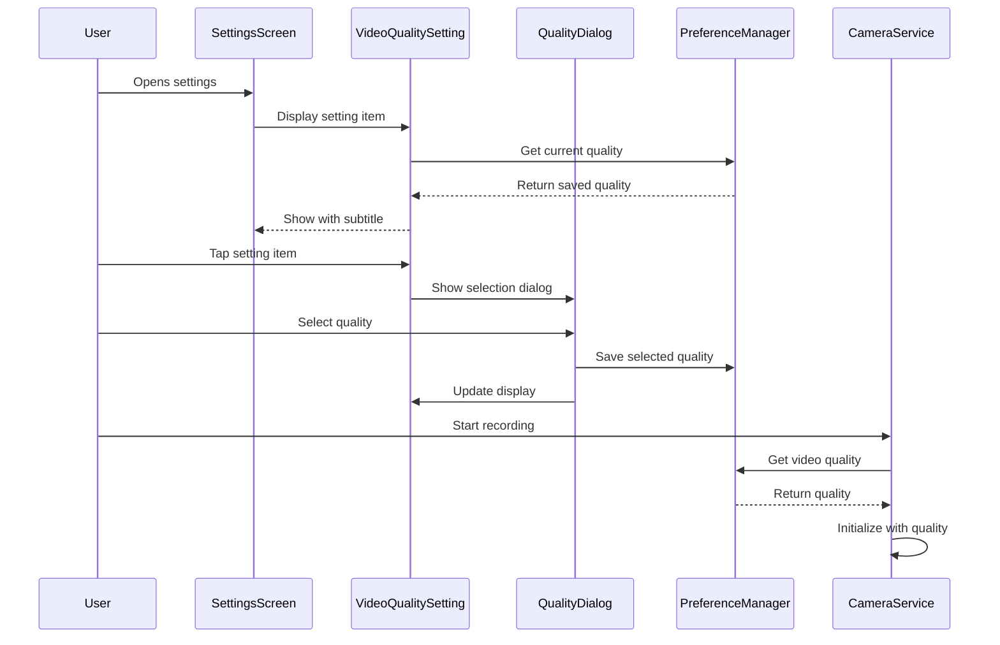

# Design Document

## Overview

This design implements a video quality selection feature for the DashCam application. The solution follows the existing settings architecture pattern, introducing a new clickable setting item that displays a dialog for quality selection. The selected quality will be persisted using SharedPreferences and applied to the camera's QualitySelector during initialization.

The design leverages the existing CameraX Quality enum values (LOWEST, SD, HD, FHD, HIGHEST, UHD) and integrates seamlessly with the current Camera service and Settings screen architecture.

## Architecture

### Component Interaction Flow



### Layer Responsibilities

- **UI Layer (Settings Screen)**: Displays the video quality setting item and handles user interaction
- **Dialog Layer (Quality Selection Dialog)**: Presents quality options and captures user selection
- **Service Layer (PreferenceManager)**: Persists and retrieves the selected quality preference
- **Service Layer (Camera)**: Applies the selected quality to video recording configuration

## Components and Interfaces

### 1. VideoQualitySetting Class

**Location**: `app/src/main/java/com/kasahirotech/dashcamapp/settings/items/VideoQualitySetting.kt`

**Purpose**: Implements the SettingItem interface to represent the video quality setting in the settings list.

**Properties**:
- `icon: Int` - Resource ID for the quality icon (e.g., `R.drawable.ic_video_quality`)
- `title: String` - Display title "Video Quality"
- `currentQuality: Quality` - The currently selected quality level

**Methods**:
- `onItemClick(context: Context, fragmentManager: FragmentManager?)` - Shows the quality selection dialog
- `getQualityDisplayName(quality: Quality): String` - Returns user-friendly quality names (e.g., "UHD (4K)", "FHD (1080p)")
- `getCurrentQualityText(): String` - Returns the display text for the current quality

### 2. Quality Selection Dialog

**Implementation**: AlertDialog with single-choice list

**Location**: Created within VideoQualitySetting.onItemClick()

**Structure**:
- Dialog title: "Select Video Quality"
- List items: Quality options with descriptive labels
- Single-choice radio buttons
- Positive button: "OK"
- Negative button: "Cancel"

**Quality Display Mapping**:
```kotlin
UHD -> "UHD (4K)"
FHD -> "FHD (1080p)"
HD -> "HD (720p)"
SD -> "SD (480p)"
HIGHEST -> "Highest Available"
LOWEST -> "Lowest Available"
```

### 3. PreferenceManager Extensions

**Location**: `app/src/main/java/com/kasahirotech/dashcamapp/service/PreferenceManager.kt`

**New Constants**:
- `KEY_VIDEO_QUALITY = "video_quality"`
- `DEFAULT_VIDEO_QUALITY = "HIGHEST"`

**New Methods**:
```kotlin
fun getVideoQuality(context: Context): Quality
fun setVideoQuality(context: Context, quality: Quality)
```

**Implementation Details**:
- Store quality as string representation of enum name
- Convert string back to Quality enum when retrieving
- Handle invalid stored values by falling back to HIGHEST
- Use try-catch for error handling consistent with existing methods

### 4. Camera Service Modifications

**Location**: `app/src/main/java/com/kasahirotech/dashcamapp/service/Camera.kt`

**Changes**:
- Modify `startCamera()` method to retrieve quality from PreferenceManager
- Replace hardcoded `Quality.HIGHEST` with dynamic quality selection
- Apply quality to QualitySelector during Recorder initialization

**Modified Code Section** (line 62):
```kotlin
// Before:
val recorder = Recorder.Builder()
    .setQualitySelector(QualitySelector.from(Quality.HIGHEST))
    .build()

// After:
val selectedQuality = PreferenceManager.getVideoQuality(activity)
val recorder = Recorder.Builder()
    .setQualitySelector(QualitySelector.from(selectedQuality))
    .build()
```

### 5. Settings Screen Integration

**Location**: `app/src/main/java/com/kasahirotech/dashcamapp/settings/Settings.kt`

**Changes**:
- Instantiate VideoQualitySetting
- Add to settingsList

**Code Addition**:
```kotlin
val videoQualitySetting = VideoQualitySetting(this)
var settingsList = mutableListOf<SettingItem>(
    audioToggle,
    dualCameraToggle,
    videoQualitySetting  // Add new setting
)
```

### 6. SettingsAdapter Modifications

**Location**: `app/src/main/java/com/kasahirotech/dashcamapp/settings/SettingsAdapter.kt`

**Changes**:
- Add VideoQualitySetting to getItemViewType() when clause
- Return VIEW_TYPE_CLICK for VideoQualitySetting
- Binding handled by existing SettingsViewHolder (no changes needed)

**Note**: VideoQualitySetting uses the clickable item layout (`item_setting.xml`) with subtitle support, not the toggle layout.

## Data Models

### Quality Enum (CameraX)

The CameraX library provides the Quality enum with these values:

```kotlin
enum class Quality {
    LOWEST,   // Lowest quality supported by device
    HIGHEST,  // Highest quality supported by device  
    SD,       // 480p (640x480 or similar)
    HD,       // 720p (1280x720)
    FHD,      // 1080p (1920x1080)
    UHD       // 4K (3840x2160)
}
```

### Preference Storage Format

**Key**: `"video_quality"`
**Value**: String representation of Quality enum name (e.g., "FHD", "HD", "HIGHEST")
**Storage**: SharedPreferences with key `"dashcam_preferences"`

## Error Handling

### Invalid Stored Quality

**Scenario**: Stored preference contains invalid quality string

**Handling**:
- PreferenceManager.getVideoQuality() catches exception
- Returns DEFAULT_VIDEO_QUALITY (HIGHEST)
- Logs error with TAG "PreferenceManager"

### Unsupported Quality on Device

**Scenario**: Device doesn't support selected quality (e.g., UHD on older device)

**Handling**:
- CameraX QualitySelector automatically falls back to nearest supported quality
- No additional handling required in application code
- QualitySelector.from() handles fallback internally

**Note**: Device capability checking is not implemented in this design as CameraX handles it automatically. Future enhancement could query supported qualities and filter the dialog list.

### Dialog Dismissal

**Scenario**: User cancels or dismisses dialog without selection

**Handling**:
- No changes made to preference
- Current quality remains unchanged
- No error state

## Testing Strategy

### Unit Tests

**Test Class**: `VideoQualitySettingTest.kt`

**Test Cases**:
1. `getQualityDisplayName_returnsCorrectLabels()` - Verify all quality enum values map to correct display strings
2. `getCurrentQualityText_returnsFormattedString()` - Verify current quality text formatting
3. `preferenceManager_storesAndRetrievesQuality()` - Verify quality persistence
4. `preferenceManager_handlesInvalidQuality()` - Verify fallback to HIGHEST on invalid data
5. `preferenceManager_defaultsToHighest()` - Verify default value on first launch

### Integration Tests

**Test Class**: `VideoQualityIntegrationTest.kt`

**Test Cases**:
1. `settingsScreen_displaysVideoQualitySetting()` - Verify setting appears in list
2. `settingsScreen_showsCurrentQuality()` - Verify subtitle displays current selection
3. `clickingSetting_opensDialog()` - Verify dialog appears on tap
4. `selectingQuality_updatesPreference()` - Verify selection persists
5. `selectingQuality_updatesDisplay()` - Verify UI updates after selection
6. `cameraService_usesSelectedQuality()` - Verify camera applies selected quality

### Manual Testing Checklist

1. Open Settings screen - verify "Video Quality" item appears
2. Verify current quality is displayed as subtitle
3. Tap Video Quality setting - verify dialog opens
4. Verify all 6 quality options are listed with descriptive labels
5. Verify current selection is marked in dialog
6. Select different quality - verify dialog closes
7. Verify setting subtitle updates to new quality
8. Close and reopen Settings - verify quality persists
9. Start video recording - verify quality is applied (check file size/resolution)
10. Change quality and record again - verify new quality is used

## UI/UX Considerations

### Setting Item Layout

Uses existing `item_setting.xml` layout with:
- Icon: Video quality icon (to be added to drawables)
- Title: "Video Quality"
- Subtitle: Current quality (e.g., "FHD (1080p)")
- Chevron: Right arrow indicating clickable item

### Dialog Design

- Material Design AlertDialog
- Single-choice list with radio buttons
- Quality options ordered from highest to lowest
- Currently selected option pre-selected in dialog
- Clear "OK" and "Cancel" actions

### Visual Feedback

- Selected quality immediately visible in settings list subtitle
- Dialog selection marked with radio button
- No loading states needed (instant preference save)

## Dependencies

### Existing Dependencies (No Changes)

- CameraX Video library (provides Quality enum)
- AndroidX AppCompat (AlertDialog)
- SharedPreferences (preference storage)

### New Resources Required

- Drawable icon: `ic_video_quality.xml` (vector drawable for setting icon)
- No new string resources needed (quality labels generated programmatically)

## Implementation Notes

### Quality Ordering

Display qualities in descending order for better UX:
1. UHD (4K)
2. FHD (1080p)
3. HD (720p)
4. SD (480p)
5. Highest Available
6. Lowest Available

### Camera Restart Requirement

Quality changes take effect on next camera initialization. Current recording is not interrupted. This is acceptable behavior as:
- Users typically configure quality before recording
- Changing quality mid-recording could cause issues
- Consistent with other camera apps

### Dual Camera Mode Compatibility

The selected quality applies to both cameras in dual camera mode. The DualCameraManager should be updated to use the same PreferenceManager.getVideoQuality() call when initializing its recorders.

## Future Enhancements

1. **Device Capability Filtering**: Query supported qualities and only show available options in dialog
2. **Quality Recommendations**: Show estimated file size or bitrate for each quality
3. **Auto Quality**: Add "Auto" option that selects quality based on available storage
4. **Per-Camera Quality**: Allow different qualities for front/back cameras in dual mode
5. **Quality Presets**: Add preset profiles (e.g., "Storage Saver", "Balanced", "Maximum Quality")
